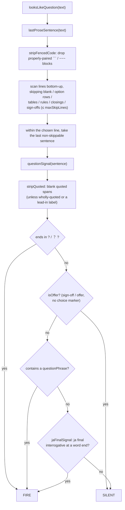

# Question-detection contract (`looksLikeQuestion`)

This is the **single source of truth** for when agentdone treats a `Stop`
message as a *plain-text confirmation question* — the `✋ Waiting for
confirmation` path that fires **regardless of the time threshold** (a normal
completion is gated by `AGENTDONE_THRESHOLD`; a question is not).

It exists because this heuristic is the most-changed, most-regressed part of the
tool: over several iterations, several fixes
silently contradicted earlier decisions because the intended behaviour lived
only in scattered test cases and code comments. Every rule below is paired with
its rationale and the review that decided it. **Before changing the heuristic,
change this document and `TestQuestionContract` together** — they are the
contract; the code (`internal/handler/question.go`, `internal/handler/lang.go`)
is the implementation.

`looksLikeQuestion` returns a single bool. `true` → surface as a waiting ping
even on a short turn. `false` → treat as a normal completion (threshold applies).
The two failure modes, in order of how bad they are for this tool:

1. **False negative (worst):** a real "Claude is waiting on me" question stays
   **silent** because it was under the threshold — the user is blocked and gets
   nothing. The tool's core promise fails.
2. **False positive:** a pure completion fires a `✋ Waiting` ping on a short
   turn — annoying noise, but the user sees the content and moves on.

When a rule is a judgement call, we lean against the false negative.

## Pipeline



Source: `internal/handler/question.go` (`looksLikeQuestion`, `lastProseSentence`,
`questionSignal`, `stripFencedCode`, `stripQuoted`, `isQuoteLeadIn`, `isOffer`,
`jaFinalSignal`, `trimDecor`) and the vocabulary lists in
`internal/handler/lang.go`.

## FIRES (treated as a waiting question)

| # | Input shape | Example | Why |
|---|---|---|---|
| F1 | Last sentence ends in `?` / `？` (decoration stripped) | `これをコミットしてよいですか？` / `**続行してよいですか？**` | The unambiguous signal. trimDecor removes trailing `*_~ \`"'」』）)】>＞»”’“`. |
| F2 | English question phrase in the last sentence | `Should I proceed` / `Want me to commit this?` / `Is it ok to start` | `questionPhrases` (en), matched on a word boundary. |
| F3 | Japanese sentence-final interrogative at a word end | `テストも実行しますか` / `…でしょうか` / `命名はこの案でいかがですか` | `jaFinalPhrases` via `jaFinalSignal`. |
| F4 | Japanese request form | `動作をご確認ください` / `動作を確認してください` | `questionPhrases` (ja request forms). |
| F5 | Question above option rows / a table / a rule / blank lines | `どちらにしますか？` + numbered list (up to `maxSkipLines`=50 rows) | Those trailing rows are `skippable`; the scan steps over them. |
| F6 | Question followed by a closing pleasantry | `Which port should the server use? Thanks.` / `…進めてよいですか？よろしくお願いします。` | The closing sentence is `skippable` (`closingPrefixes` / `よろしくお願い`). |
| F7 | Question followed by a sign-off | `Should I refactor this? Let me know.` | The sign-off is `skippable`; the real question before it is found. |
| F8 | Wholly-quoted question, or a lead-in label + quoted question | `「このまま削除してもよいですか？」` / `My question: "Should I deploy now?"` / `My question: «Proceed?»` | The quote IS the message — `stripQuoted` is skipped (nothing alphanumeric outside, or `isQuoteLeadIn`). |
| F9 | Choice phrased with an interrogative determiner | `Let me know which approach you want me to take.` / `Let me know whether you want me to continue.` | `which`/`whether` is a `choiceMarker` → not an offer → the question phrase fires. |
| F10 | Prolongation-stretched ja question at the end | `このまま進めますかー` / `…ますかー？` | `isProlong` (ー〜～…) is skipped to reach the true word end. |

## SILENT (treated as a normal completion)

| # | Input shape | Example | Why |
|---|---|---|---|
| S1 | Plain completion report | `全部できました。` / `All tests pass and the change is pushed.` | No signal. |
| S2 | A question phrase that is NOT in the last prose sentence | `ご確認用のスクリプトを作成し、テストを追加して main にプッシュしました。報告は以上です。` | Scoped to the last sentence (`報告は以上です。`); the earlier `ご確認` doesn't count. (Abbreviating this to one sentence would make `ご確認` the *last* sentence and it would fire.) |
| S3 | Sign-off offer of more work | `All tests pass. Let me know if you want me to dig deeper.` | `isOffer` (`let me know` / `if you want me to` / `happy to` / `just say so`), stripping a leading `please`/`just`/markdown. |
| S4 | Offer that lists follow-ups with a benign `or` | `Let me know if you want me to add tests **or** update the docs.` | **`or` is NOT a choice marker** — see Decision D1. |
| S5 | Reported / quoted question (surrounding prose) | `The installer asked 'Should I overwrite?' and I answered yes.` / `確認ダイアログ「削除しますか」は自動でスキップ…` | `stripQuoted` blanks the quote; the remainder has no signal. |
| S6 | Reported question after a *reporting verb* lead-in | `The installer asked: "Should I overwrite?"` / `The user said: "…?"` | `isQuoteLeadIn` declines to rescue a lead-in that contains a `reportingVerb` — see Decision D2. |
| S7 | Last line is a code block whose last line ends in `?` | `…完了です。` + ` ```swift … var name: String? ``` ` | `stripFencedCode` drops properly-paired fences first. |
| S8 | ja "reason"/"musing" forms that merely contain `ますか` | `…実行しますから、…` / `…動きますかね、…` | `jaFinalSignal` requires a word end; `から`/`ね` follow the match. |
| S9 | Declarative use of a stem that used to false-fire | `この設定は削除して大丈夫です。` / `進めてよろしいとの承認をいただいた…` | The stems `して大丈夫` / `進めてよろしい` were removed from `questionPhrases`; only the interrogative `…大丈夫ですか` fires (D3). |

## Decisions & deliberate trade-offs (do not silently reverse)

These are the points where two reasonable behaviours conflict. Each was decided
once; re-opening one means updating this section, not just the code.

- **D1 — `or` is not a choice marker.**
  `Let me know if you want me to do A or B` is a *completion offer*, not a
  waiting question, even though it lists options. An earlier version briefly treated
  `… or …` as a real choice (to catch `option B or stick with A`), but that made
  the extremely common `add tests or update docs` sign-off fire on every short
  turn (a regression). Resolution: only `which` / `whether` / `どちら` / `それとも`
  are choice markers. **Cost (accepted):** `Let me know if you want me to proceed
  with option B or stick with A.` now reads as an offer and stays silent.
  → `choiceMarkers` in `lang.go`. **Do not add `" or "` back.**

- **D2 — a lead-in label rescues a quoted question, but a *reporting verb* does not.**
  `My question: "…?"` fires (the assistant is asking); `The installer asked:
  "…?"` stays silent (reported speech). Both end the lead-in with `:` / `—`, so
  they are told apart by `reportingVerbs` (`asked`/`said`/`printed`/`表示`/…).
  → `isQuoteLeadIn` + `reportingVerbs`.
  **Known gap (out of scope):** a ja report whose quote uses `「…？」` —
  `…表示しました：「削除しますか？」` — still fires, because `？` splits the
  sentence and leaves the `「」` unbalanced so `stripQuoted` can't act. Fixing it
  risks breaking the legitimate `確認です：「…？」` (F8); left as-is. Pre-existing,
  not a new regression.

- **D3 — sentence-final interrogative, not bare stem.**
  `して大丈夫` / `進めてよろしい` were removed from `questionPhrases` because they
  matched the declarative `削除して大丈夫です` (a safety report). The interrogative
  forms `…大丈夫ですか` / `…よろしいですか` are in `jaFinalPhrases` instead.

- **D4 — no whole-text "ends in `?`" fast path.**
  Everything goes through `lastProseSentence` so a trailing code fence is dropped
  first; otherwise `var name: String?` / `WHERE deleted = ?` would be read as a
  question (D-S7).

- **D5 — fences are stripped only when properly paired.**
  `stripFencedCode` removes a block only when a matching close (same marker char,
  ≥ length, no info string) exists. A `~~~` inside a ` ``` ` block is content;
  `"```go"` does not close. An **unterminated / mismatched** fence is left in
  place rather than swallowing the rest — missing a trailing question (false
  negative) is worse than keeping a code line.

- **D6 — prolongation marks don't break a ja word end.**
  `ますかー` at the end fires (colloquial stretch); `ますかーと言った` mid-sentence
  does not (the run is skipped, then a true word end is required).

- **D7 — both languages are always checked.**
  The display locale (`AGENTDONE_LANG`) only picks notification *labels*. A
  session run in English routinely ends on a Japanese question and vice-versa, so
  `questionSignal` checks en and ja phrase sets unconditionally.

## Where the knobs live (`internal/handler/lang.go`)

| List | Role |
|---|---|
| `questionPhrases` | en question phrases + ja request forms → FIRE |
| `jaFinalPhrases` | ja sentence-final interrogatives (word-end matched) → FIRE |
| `signoffPrefixes` | `let me know` sign-off start → offer (SILENT) unless a choice marker |
| `offerPhrases` | `if you want me to` / `happy to` / `just say so` / … → offer (SILENT) |
| `choiceMarkers` | `which` / `whether` / `どちら` / `それとも` → real decision (NOT `or`, D1) |
| `closingPrefixes` | `thanks` / `note:` / `fyi` / … → skippable trailing aside |
| `reportingVerbs` | `asked` / `said` / `表示` / … → a lead-in is reported speech, don't rescue (D2) |

## Changing the heuristic

1. Add the new case (FIRE or SILENT) to the tables above, with a one-line *why*.
2. If it conflicts with an existing Decision, update that Decision (don't just
   flip the code) and note the new trade-off.
3. Add the case to `TestQuestionContract`
   (`internal/handler/question_contract_test.go`), in the group whose `clause`
   label lists this clause id (a group often covers several — e.g. `D1/F9/S4`;
   locale-independence D7 has its own `TestQuestionContract_D7LocaleIndependent`).
4. Run `go test ./internal/handler/` — and, for any regression-prone change,
   confirm the test **fails** when you revert the fix (an inert test is worse
   than none).
